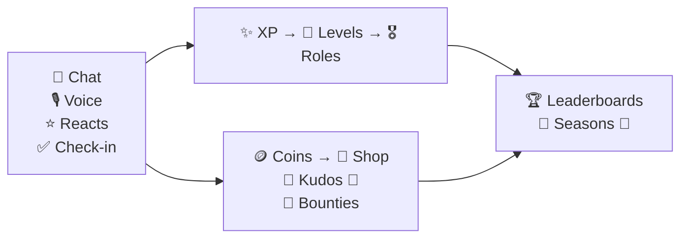
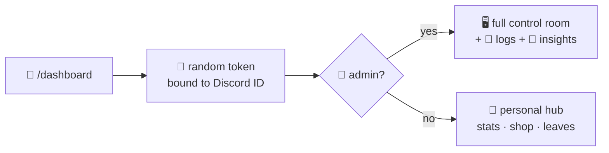
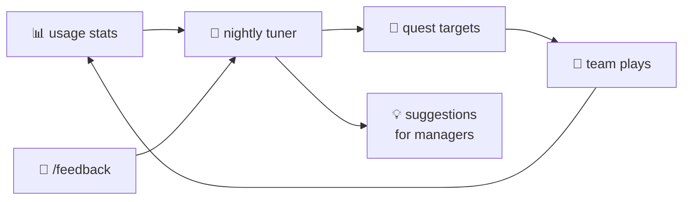

<div align="center">


[](https://github.com/anomalyco/opencode)


*Attendance + activity tracker with gamification — built for teams with **flexible shifts** 🕊️*
*Check in anytime, earn XP & coins 🪙, complete quests 🗺️, climb leaderboards 🏆, spend in the shop 🏪*

**Made with 💜 by [GlyteTech](https://www.glyte.tech)** · 🌐 [www.glyte.tech](https://www.glyte.tech) · 📧 [info@glyte.tech](mailto:info@glyte.tech)

</div>

---

## ✨🌟 Features at a glance

| | | |
|---|---|---|
| 🗓️ **Flexible check-ins** — no fixed shifts, streaks 🔥 | 📊 **Auto activity tracking** — chat, voice, reactions | 🎮 **Full gamification** — XP, coins, quests, badges, shop |
| 🌙 **EOD summaries** — present / absent / on-leave, auto-posted | 🧍 **Standups** — morning thread + compiled updates | 📈 **Weekly CSV reports** — attendance %, top contributors |
| 🙌 **Kudos** — peer appreciation with coin tips | 🎯 **Bounty board** — paid team tasks | 🏁 **Monthly seasons** — fresh leaderboard + champion 👑 |
| 🖥️ **Web dashboard** — `/dashboard` magic link = auto-login ✨ | 🙋 **Personal hub** — stats, quests, shop, leaves | 👑 **Admin room** — everything + 📜 logs + 🧠 insights |

---

## 🗓️ Attendance (flexible-shift friendly 🌈)

- ✅ `/checkin` — mark attendance from anywhere, anytime → +20 XP, +25 🪙, streak 🔥 grows
- 🎁 Streak bonuses — bonus coins at **7 / 14 / 30 / 60 / 100-day** streaks + exclusive badges 🏅
- 🎙️ Voice days count too — hang out in voice, get attendance credit
- 🗓️ `/attendance [@member] [days]` — presence history: `✅ check-in` · `🎙️ voice` · `🌴 approved leave`
- 🌴 Leave flow — `/leave_apply` (interactive popup modal or slash command) → creates card with 1-click **[Approve ✅]** and **[Reject ❌]** buttons for managers + DM notifications
- 🌙 **EOD summary** — every night the bot auto-posts who was present ✅, absent ❌, and on leave 🌴 (+ `/eod` to trigger manually)

## 📊 Activity tracking (always on ⚡)

- 💬 **Messages** → XP + coins (5s anti-farm cooldown 🛡️)
- 🎙️ **Voice sessions** → XP per minute + coins, tracked join → leave
- ⭐ **Reactions** → XP + coins
- 🎯 **Deep Work Focus** — `/focus [minutes] [task]` Pomodoro deep work sprint with live timer & rewards
- 🗂️ Per-day breakdowns stored for every member (powers quests, reports & seasons)

## 🎮 Gamification (the fun part 🥳)

- 📶 **Levels** — XP progress bar, loud level-up announcements 📢 + auto-grant roles (`/reward_add`)
- 🪙 **Coins** — trickle in from everything; claim extra with `/daily` 🎁
- 🎰 **Lucky Wheel (`/spin`)** — free daily spin (extra spins 25 🪙) for coins, XP, and `lucky-spinner` / `jackpot-king` badges!
- 🗺️ **Daily quests** — ✅ check-in · 💬 chatter · 🎙️ voicer · ⭐ reactor (`/quests` → `/quest_claim`)
- 🏅 **Badges** — `first-checkin` 🌱 · `streak-7` 🔥 · `streak-30` 💎 · `deep-worker` 🎯 · `chatter-1000` 💬 · `voicer-100h` 🎙️ · `rich-5k` 💰 · `jackpot-king` 👑 (`/badges`)
- 🏪 **Shop** — redeemable team perks (`/shop` → `/buy` → `/inventory`)
- 🏆 **Leaderboards** — XP · coins · messages · voice · check-ins (`/leaderboard`)
- 🏁 **Monthly seasons** — fresh race every month, previous champion crowned 👑 with bonus coins (`/season`)

## 🤝 Team rituals

- 🧍 `/standup` — post yesterday / today / blockers; bot opens a morning thread, managers compile with `/standup_list`
- 🙌 `/kudos @member <reason>` — public shout-out + coin tip 💸 (3/day anti-farm)
- 🎯 **Bounty board** — `/bounty_post` (coins escrowed) → `/bounty_list` → `/bounty_claim` → `/bounty_approve` pays out 💰
- 📈 `/report [days]` — manager CSV: messages, voice, XP, check-ins, leaves + top-contributor summary

## 🛠️ Admin & data

- 📤 `/export` — full data dump as JSON (Manage Server only)
- 🪙 `/give_coins` — manual rewards
- 🗄️ MongoDB (Atlas-ready) + in-memory cache with bulk flush — fast ⚡, low write cost 💸
- 🐳 Dockerized for one-command VPS hosting

---

## 📜⌨️ All commands

<details open>
<summary><b>🙋 Everyone</b></summary>

| Command | Does what 🎯 |
|---|---|
| ✅ `/checkin` | Mark today's attendance, streak + rewards |
| 🎁 `/daily` | Claim daily coins |
| 📊 `/mystats [@member]` | Level, XP, coins, activity, badges |
| 🏆 `/leaderboard [category]` | Top members (xp / coins / messages / voice / check-ins) |
| 🏁 `/season [month]` | Monthly season leaderboard + last champion |
| 🗺️ `/quests` | Today's quests + progress |
| 🎉 `/quest_claim <id>` | Claim a finished quest |
| 🏪 `/shop` | Browse the rewards shop |
| 🛍️ `/buy <item>` | Buy with coins |
| 🎒 `/inventory` | Your owned items |
| 🏅 `/badges [@member]` | Badge showcase |
| 🗓️ `/attendance [@member] [days]` | Presence history (default 7d, max 30d) |
| 🌴 `/leave_apply [days] [reason]` | Apply for leave (interactive popup modal + 1-click manager buttons) |
| 📝 `/my_leaves` | Your leave requests |
| 🎯 `/focus [minutes] [task]` | Pomodoro deep work session (5–120m) with XP & coin rewards |
| 🎰 `/spin` | Daily Lucky Wheel — win coins, XP, and rare badges (free daily!) |
| 🧍 `/standup` | Post standup update (yesterday / today / blockers) |
| 🙌 `/kudos @member <reason>` | Shout-out + coin tip |
| 🎯 `/bounty_list` | Open bounties |
| 🤝 `/bounty_claim <id>` | Claim a bounty task (generates 1-click payout card) |
| 📊 `/dashboard [hours]` | Your personal magic link — auto-logged-in as you ✨ |
| 💌 `/feedback <text>` | Teach the bot — it learns from this 🧠 |
| 💜 `/about` | Who made this bot — GlyteTech 🏢 |

</details>

<details>
<summary><b>🛡️ Managers (Manage Server)</b></summary>

| Command | Does what 🎯 |
|---|---|
| 📊 `/dashboard [hours]` | Fresh magic-link dashboard (random URL, 24h default) |
| 🧠 `/insights` | Team health + quest auto-tunes + suggestions |
| 🌙 `/eod` | Post today's EOD summary now |
| 🧍 `/standup_list [date]` | Compiled standups for a day |
| 📈 `/report [days]` | CSV report + summary (default 7d) |
| 🌴 `/leave_list` | Pending leaves |
| ✅❌ `/leave_decide <id> <approve>` | Approve / reject leave |
| 🎖️ `/reward_add <level> <role>` | Auto-role on level-up |
| 🎖️ `/reward_list` | Level-role mapping |
| 🪙 `/give_coins <member> <amount>` | Grant coins |
| 🎯 `/bounty_post <title> <coins>` | Post paid task (coins escrowed) |
| 💰 `/bounty_approve <id>` | Approve work → pays the claimer |
| 📤 `/export` | JSON data dump |

</details>

---

## 💰🪙 Economy (defaults, tunable via `.env`)



| Action 🎬 | ✨ XP | 🪙 Coins |
|---|---|---|
| 💬 Message (5s cooldown) | +10 | +2 |
| 🎙️ Voice minute | +1 | +1 per 5 min |
| ⭐ Reaction added | +2 | +1 |
| ✅ Check-in | +20 | +25 |
| 🎁 Daily claim | — | 100 + streak×5 (max +150) |
| 🗺️ Quest | +20–40 | +30–60 |
| 🙌 Kudos received | — | +20 |
| 🎯 Bounty | — | as posted 💰 |
| 📶 Level up | every 150 XP | — |

## 🏪🛍️ Default shop

| ID | Item | Cost |
|---|---|---|
| `coffee` | ☕ Coffee Break | 200 🪙 |
| `earlylog` | 🚀 Early Logout (needs manager OK) | 500 🪙 |
| `mvp` | 🏅 MVP Nomination | 800 🪙 |
| `wfh` | 🏠 WFH Half-day (needs manager OK) | 1000 🪙 |

> 🗄️ Shop lives in Mongo (`config` collection) — edit perks without touching code. ✨

---

## 📊🖥️ Web dashboard

Anyone runs `/dashboard` in Discord → gets a **fresh random magic link** ✨ visible **only to them** (ephemeral reply). The link **is the login** — it's bound to their Discord identity, so the dashboard opens already knowing who they are 🙋 — no passwords, no OAuth screens.

Dark-themed 🌑, animated ✨, emoji-loaded 🥳, live-updating 🔄:

**🙋 Personal hub (everyone)**
- 🙋 **Me** — level bar 📶, coins 🪙, streak 🔥, badges 🏅, season XP
- 🗓️ **My Days** — your attendance timeline ✅🎙️🌴
- 🗺️ **Quests** — progress bars + one-tap claim 🎉
- 🏪 **Shop** — buy with your coins 🛍️ + 🎒 inventory
- 🌴 **My Leaves** — history + apply 📝

**👑 Admin control room (Manage Server only — auto-detected 🕵️)**
- Everything above, plus: 🌙 Overview charts · 🏆 Ranks · 👥 Team attendance · ✅ Leave approvals · 🎖️ Reward mapping · 🎯 Bounty posting/payouts · 🪙 Coin grants · 🌙 one-tap EOD
- 🧠 **Insights** — engagement metrics, quest completion rates, auto-tune history, feedback inbox
- 📜 **Logs** — live bot logs + 👁️ dashboard access log (who opened what, when, from which IP)



> 🔒 Tokens live in Mongo with TTL auto-cleanup; every page view is access-logged. Set `DASHBOARD_PUBLIC_URL` to your `http://VPS-IP:8080` and open the port.

## 🚀🛫 Setup

### 1️⃣ Discord app 🤖
1. https://discord.com/developers → New Application → Bot → **Reset Token** → copy it (🤫 keep secret!)
2. Enable intents ✅: **Server Members** + **Message Content**
3. Invite URL 🔗: OAuth2 → scopes `bot` + `applications.commands` → permissions: Manage Roles 🎖️, Send Messages 💬, Embed Links 🔗, Attach Files 📎

### 2️⃣ MongoDB Atlas 🍃
1. Free cluster → Database Access 👤 → add user + password
2. Network Access 🌐 → allow your VPS IP (or `0.0.0.0/0` for testing)
3. Connect → Drivers → copy the `mongodb+srv://` string 🔑

### 3️⃣ Run with Docker on VPS 🐳
```bash
cp .env.example .env
nano .env   # ✏️ fill DISCORD_TOKEN + MONGO_URI — never commit this file! 🚫
docker compose up -d --build
docker compose logs -f bot
```
Then open the dashboard port on your VPS firewall 🔥 (default `8080`) and set `DASHBOARD_PUBLIC_URL=http://YOUR-VPS-IP:8080` in `.env` — `/dashboard` links will use it 🔗.

### 4️⃣ Run locally 💻
```bash
cp .env.example .env   # ✏️ fill secrets
pip install -r requirements.txt
python bot.py
```

⏳ Slash commands register on startup (can take a few minutes to appear in Discord).

## ⚙️🔧 `.env` options

| Key 🔑 | Default | Purpose 💡 |
|---|---|---|
| `DISCORD_TOKEN` | — | Bot token (🤫 secret!) |
| `MONGO_URI` | localhost | Atlas `mongodb+srv://…` or docker `mongodb://…` |
| `MONGO_DB` | `discord_bot` | Database name |
| `XP_PER_MSG` | `10` | XP per message |
| `MSG_COOLDOWN_S` | `5` | Anti-farm cooldown 🛡️ |
| `FLUSH_EVERY_S` | `30` | Cache → Mongo flush interval ⚡ |
| `SUMMARY_CHANNEL_ID` | — | 🌙 EOD summary channel |
| `SUMMARY_TIME` | `23:00` | 🌙 EOD post time (24h) |
| `SUMMARY_TZ` | `UTC` | 🌙 Timezone (e.g. `Asia/Kolkata`) |
| `STANDUP_CHANNEL_ID` | — | 🧍 Standup channel |
| `STANDUP_TIME` | `10:00` | 🧍 Morning thread time (24h) |
| `DASHBOARD_PORT` | `8080` | 📊 Dashboard port |
| `DASHBOARD_PUBLIC_URL` | `http://localhost:8080` | 📊 Base URL used in `/dashboard` links |

## 🧠🔄 Self-improving engine (Hermes-style ✨)

The bot watches itself and gets better every day — no AI key needed:

- 📊 **Learns usage** — every check-in, quest, kudos, standup & command feeds daily stats (fire-and-forget, zero lag)
- 🎯 **Auto-tunes quests** — every night it compares 7-day completion rates vs team size and nudges targets toward the sweet spot (too hard 👇 lowers, too easy 👆 raises, with safe bounds). Full history in `/insights` + 🧠 dashboard tab
- 💡 **Suggests actions** — low check-ins? zero kudos? unread feedback? It tells managers what to do
- 💌 **Feedback loop** — `/feedback` notes land straight in the 🧠 tab; the tuner + suggestions adapt around them
- 📜 **Transparent** — every auto-tune is logged with date, old → new target, and completion rate



> 🔮 Next level: plug an LLM key in and the 🧠 tab can narrate standups, draft EOD highlights & predict churn. The hooks are ready.

## 🗂️📁 Project structure

```
Glyte-Discord-Bot/
├── 🤖 bot.py              # everything: tracking, gamification, leaves, shop, rituals, dashboard API
├── 🖥️ dashboard.html       # dark animated dashboard UI ✨
├── 📦 requirements.txt
├── 🐳 Dockerfile
├── 🐳 docker-compose.yml  # bot + local mongo (unused if MONGO_URI → Atlas)
├── 🤫 .env                # YOUR secrets — gitignored, never commit 🚫
├── 📝 .env.example        # safe template ✅
├── ⚖️ LICENSE             # MIT — free to use & share 💛
└── 📖 README.md           # you are here! 👋
```

## ⚖️ License

MIT — use it, fork it, flex it in your portfolio 💼✨. Just keep the copyright notice. See [LICENSE](LICENSE).

## 🗺️🚀 Roadmap — coming next?

- 🎉 Birthdays, work anniversaries, welcome/onboarding flows
- ✅ ~~Web dashboard v1~~ — shipped! 📊 (run `/dashboard`)
- ✅ ~~Personal login + admin control room + logs~~ — shipped! 🙋👑📜
- ✅ ~~Self-improving quests + insights~~ — shipped! 🧠 (see `/insights`)
- 🛡️ Moderation helpers — strikes, slowmode, spam guard
- ⏰ Smart reminders — check-in nudges, leave-decision pings
- 🎤 Focus rooms — pomodoro voice lounges with bonus XP

PRs welcome — pick one and ship it! 🚢💨

## 💜 Credits

Built and maintained by **[GlyteTech](https://www.glyte.tech)** 🏢✨
🌐 Website: [www.glyte.tech](https://www.glyte.tech) · 📧 Email: [info@glyte.tech](mailto:info@glyte.tech)

Need a custom bot, dashboard or automation for your team? Talk to us 💬🚀

<div align="center">


**Made with 💜 by [GlyteTech](https://www.glyte.tech) · ☕ and too many `/checkin` streaks 🔥**
**🌐 [www.glyte.tech](https://www.glyte.tech) · 📧 [info@glyte.tech](mailto:info@glyte.tech)**

</div>
